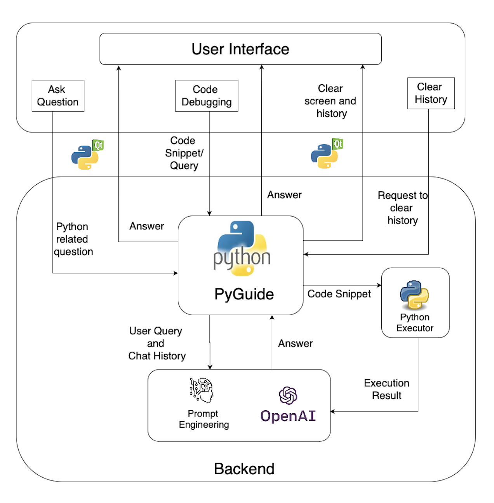

## Name
PyGuide: An Intelligent Python Lab Assistant for Enhanced Debugging and Learning Experience 

## Description
In an era where computer programming skills are foundational, effective learning tools play a pivotal role in nurturing proficient programmers. PyGuide is an intelligent Python lab assistant designed to transform Python learning experiences. This innovative tool aims to provide real-time guidance, debugging assistance, and an engaging learning environment for Python enthusiasts.

## Architecture

## Usage
- Clone the git repository : 'https://github.com/shreyu258/pyhton_lab_assistant.git'
- Open any IDE and then open the cloned folder.
- Install the requirements : `pip install -r requirements.txt`
- Set the OpenAI API key in the config.py file
- Run the application : `python main.py`
- A user interface will pop up allowing users to interact with PyGuide.

## Structure of the repository

- config.py  <- configuration file with constant values.
- README.md   <- README for developers using this project.
- requirements.txt    <- Text file with all the libraries required for the project.
- architecture.png    <- System Architecture Diagram.
- main.py    <- main script for flow of the application.
- eventHandler.py <- script that holds all the backend functions.
- messageFrame.py    <- script with the design of message components of the interface.
- mainWindow.py    <- script with all the functions to create GUI.

## References

- [GoogleAI](https://deepmind.google/technologies/gemini/)
- [Python](https://www.python.org/)
- [PyQt5](https://pypi.org/project/PyQt5/)
